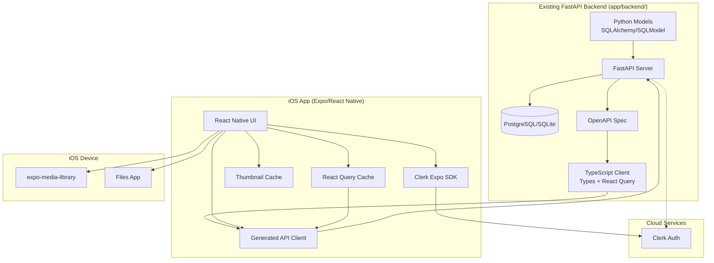

# Design Document: Dance Partner MVP

## Overview

Dance Partner is an online-first iOS mobile application that helps dancers organize, annotate, and practice from their dance class recap videos. The system uses a client-server architecture where Python models (SQLAlchemy/SQLModel) in the existing FastAPI backend define the schema as source of truth, and mobile devices communicate exclusively through REST API endpoints with heavy local caching for performance.

### Key Architectural Decisions

- **Python Models as Source of Truth:** SQLAlchemy/SQLModel models in existing `app/backend/` define the database schema; OpenAPI generates TypeScript client
- **Extend Existing Backend:** Dance Partner models added to existing FastAPI backend alongside User/Item/Tag models
- **Online-First with Heavy Caching:** Mobile app requires network connectivity for data operations but uses aggressive local caching for performance
- **Clerk Authentication:** `@clerk/clerk-expo` for mobile auth, FastAPI validates Clerk JWTs for API calls
- **Asset ID Storage:** Videos referenced via `expo-media-library` asset IDs (not copied)
- **Thumbnail Caching:** Thumbnails generated locally on recap creation for fast library browsing
- **All Data via API:** All user data (recaps, notes, tags, dance styles) served through FastAPI REST endpoints
- **Single Database:** FastAPI backend with PostgreSQL/SQLite as primary data store with user_id filtering for row-level isolation
- **Multi-Device Support:** Data automatically synced across devices through shared backend; no manual export/import needed
- **Cache Strategy:** React Query for API state management with configurable cache times and background refresh

## Architecture



### Data Flow

1. **Schema Definition:** Python models (SQLAlchemy/SQLModel) in `app/backend/app/models.py` define schema → Alembic migrations run on PostgreSQL/SQLite → Mobile receives data via REST API
2. **User Authentication:** Mobile app authenticates via Clerk (`@clerk/clerk-expo`) → receives JWT → stores securely; FastAPI validates Clerk JWTs for protected endpoints
3. **User Data (Recaps, Notes, Tags):** Created/updated via FastAPI REST endpoints → stored in backend database → cached locally via React Query
4. **Data Caching:** React Query manages API state with configurable cache times → background refresh keeps data current → optimistic updates for better UX
5. **Video Access:** `expo-media-library` asset IDs stored via API → resolved at playback time via expo-media-library APIs
6. **TypeScript Types:** OpenAPI spec generated from FastAPI → openapi-typescript generates types, React Query hooks, Zod validation
7. **Multi-Device Sync:** All data automatically synced across devices through shared backend → no manual export/import needed

## Components and Interfaces

### Mobile App Components

```typescript
// Authentication Service
interface AuthService {
  signInWithGoogle(): Promise<AuthResult>;
  signOut(): Promise<void>;
  getSession(): Session | null;
  refreshSession(): Promise<Session>;
  isAuthenticated(): boolean;
}

interface AuthResult {
  success: boolean;
  user?: User;
  error?: string;
}

interface Session {
  accessToken: string;
  refreshToken: string;
  expiresAt: number;
  user: User;
}
```

```typescript
// Dance Style Service (uses React Query hooks)
interface DanceStyleService {
  useGlobalStyles(): UseQueryResult<DanceStyle[]>;
  useUserStyles(): UseQueryResult<DanceStyle[]>;
  createStyle: UseMutationResult<DanceStyle, Error, CreateDanceStyleInput>;
  updateStyle: UseMutationResult<DanceStyle, Error, { styleId: string; updates: UpdateDanceStyleInput }>;
  deleteStyle: UseMutationResult<void, Error, { styleId: string; reassignTo?: string }>;
  getLastViewedStyle(): string | null; // Local storage only
  setLastViewedStyle(styleId: string): void; // Local storage only
}

interface CreateDanceStyleInput {
  name: string;
  description?: string;
}

interface UpdateDanceStyleInput {
  name?: string;
  description?: string;
}
```

```typescript
// Recap Service (uses React Query hooks)
interface RecapService {
  useRecaps(filters?: { styleId?: string; tagId?: string; search?: string }): UseQueryResult<Recap[]>;
  useRecap(recapId: string): UseQueryResult<Recap>;
  createRecap: UseMutationResult<Recap, Error, CreateVideoRecapInput>;
  updateRecap: UseMutationResult<Recap, Error, { recapId: string; updates: UpdateRecapInput }>;
  deleteRecap: UseMutationResult<void, Error, string>;
  relinkVideo: UseMutationResult<Recap, Error, { recapId: string; newAssetId: string }>;
  checkVideoAvailability(assetId: string): Promise<boolean>; // Local check only
}

interface CreateVideoRecapInput {
  danceStyleId: string;
  title: string;
  description?: string;
  assetId: string;  // expo-media-library asset ID
}

interface UpdateRecapInput {
  title?: string;
  description?: string;
  danceStyleId?: string;
  assetId?: string; // For re-linking
}
```

```typescript
// Tag Service (uses React Query hooks)
interface TagService {
  useGlobalTags(): UseQueryResult<Tag[]>;
  useUserTags(): UseQueryResult<Tag[]>;
  createTag: UseMutationResult<Tag, Error, CreateTagInput>;
  deleteTag: UseMutationResult<void, Error, string>;
  applyTagToRecap: UseMutationResult<void, Error, { recapId: string; tagId: string }>;
  removeTagFromRecap: UseMutationResult<void, Error, { recapId: string; tagId: string }>;
}

interface CreateTagInput {
  title: string;
  description?: string;
}
```

```typescript
// Note Service (uses React Query hooks)
interface NoteService {
  useNotesByRecap(recapId: string): UseQueryResult<Note[]>;
  createNote: UseMutationResult<Note, Error, { recapId: string; content: string }>;
  updateNote: UseMutationResult<Note, Error, { noteId: string; content: string }>;
  deleteNote: UseMutationResult<void, Error, string>;
}
```

```typescript
// Video Library Service (uses React Query hooks)
interface VideoLibraryService {
  useAllVideos(): UseQueryResult<RecapWithThumbnail[]>;
  useVideosByStyle(styleId: string): UseQueryResult<RecapWithThumbnail[]>;
  useVideosByTag(tagId: string): UseQueryResult<RecapWithThumbnail[]>;
  useSearchVideos(query: string): UseQueryResult<RecapWithThumbnail[]>;
}

interface RecapWithThumbnail extends Recap {
  thumbnailUri: string | null; // Local cache path
}
```

```typescript
// Thumbnail Service
interface ThumbnailService {
  generateThumbnail(assetId: string): Promise<string>;
  getThumbnail(recapId: string): Promise<string | null>;
  deleteThumbnail(recapId: string): Promise<void>;
  clearCache(): Promise<void>;
}

// Device Service
interface DeviceService {
  getDeviceId(): Promise<string>;
  getDeviceName(): Promise<string>;
}
```

```typescript
// Export/Import Service
interface ExportImportService {
  exportLibrary(userId: string): Promise<ExportData>;
  importLibrary(userId: string, data: ExportData, mode: ImportMode): Promise<ImportResult>;
  serializeToJson(data: ExportData): string;
  deserializeFromJson(json: string): ExportData;
}

type ImportMode = 'merge' | 'replace';

interface ExportData {
  version: string;
  exportedAt: string;
  sourceDeviceId: string;
  sourceDeviceName: string;
  danceStyles: DanceStyle[];
  recaps: Recap[];
  tags: Tag[];
  notes: Note[];
  recapTags: RecapTag[];
}

interface ImportResult {
  success: boolean;
  imported: {
    danceStyles: number;
    recaps: number;
    tags: number;
    notes: number;
  };
  flaggedForRelink: string[]; // recap IDs with unavailable videos
  errors: string[];
}
```

```typescript
// Cache Management Service
interface CacheService {
  clearCache(): Promise<void>;
  refreshAllData(): Promise<void>;
  getCacheStatus(): CacheStatus;
}

interface CacheStatus {
  lastRefresh: string;
  cacheSize: number;
  isOnline: boolean;
}
```

### Backend API Endpoints

```typescript
// FastAPI Endpoints (OpenAPI spec) - extends existing app/backend/
interface BackendAPI {
  // Authentication (Clerk JWT validation)
  'POST /auth/clerk/validate': {
    request: { token: string };
    response: { valid: boolean; userId?: string; error?: string };
  };
  
  // User sync (for Clerk user creation/lookup)
  'POST /users/sync': {
    request: { clerkUserId: string; email: string; displayName: string };
    response: User;
  };
  
  // Dance Styles
  'GET /dance-styles/global': {
    response: DanceStyle[];
  };
  'GET /dance-styles/user': {
    response: DanceStyle[];
  };
  'POST /dance-styles': {
    request: CreateDanceStyleInput;
    response: DanceStyle;
  };
  'PUT /dance-styles/{styleId}': {
    request: UpdateDanceStyleInput;
    response: DanceStyle;
  };
  'DELETE /dance-styles/{styleId}': {
    request: { reassignTo?: string };
    response: { success: boolean };
  };
  
  // Recaps
  'GET /recaps': {
    query: { styleId?: string; tagId?: string; search?: string };
    response: Recap[];
  };
  'GET /recaps/{recapId}': {
    response: Recap;
  };
  'POST /recaps': {
    request: CreateVideoRecapInput;
    response: Recap;
  };
  'PUT /recaps/{recapId}': {
    request: UpdateRecapInput;
    response: Recap;
  };
  'DELETE /recaps/{recapId}': {
    response: { success: boolean };
  };
  
  // Tags
  'GET /tags/global': {
    response: Tag[];
  };
  'GET /tags/user': {
    response: Tag[];
  };
  'POST /tags': {
    request: CreateTagInput;
    response: Tag;
  };
  'DELETE /tags/{tagId}': {
    response: { success: boolean };
  };
  'POST /recaps/{recapId}/tags/{tagId}': {
    response: { success: boolean };
  };
  'DELETE /recaps/{recapId}/tags/{tagId}': {
    response: { success: boolean };
  };
  
  // Notes
  'GET /recaps/{recapId}/notes': {
    response: Note[];
  };
  'POST /recaps/{recapId}/notes': {
    request: { content: string };
    response: Note;
  };
  'PUT /notes/{noteId}': {
    request: { content: string };
    response: Note;
  };
  'DELETE /notes/{noteId}': {
    response: { success: boolean };
  };
}
```

## Data Models

```typescript
// Core Entities
interface User {
  id: string;           // UUID from WorkOS
  email: string;
  displayName: string;
  createdAt: string;    // ISO 8601
  updatedAt: string;    // ISO 8601
  lastViewedStyleId: string | null;
}

interface DanceStyle {
  id: string;           // UUID
  userId: string | null; // null for global styles
  name: string;
  description: string | null;
  isGlobal: boolean;
  createdAt: string;
  updatedAt: string;
}

interface Recap {
  id: string;           // UUID
  userId: string;
  danceStyleId: string;
  title: string;
  description: string | null;
  assetId: string;      // expo-media-library asset ID (e.g., "PH://...")
  thumbnailUri: string | null; // Local cache path
  videoAvailable: boolean;
  sourceDeviceId: string | null; // Device ID where video was originally added
  createdAt: string;
  updatedAt: string;
}

interface Tag {
  id: string;           // UUID
  userId: string | null; // null for global tags
  title: string;
  slug: string;         // auto-generated from title
  description: string | null;
  isGlobal: boolean;
  createdAt: string;
  updatedAt: string;
}

interface Note {
  id: string;           // UUID
  recapId: string;
  content: string;      // Plain text for MVP
  createdAt: string;
  updatedAt: string;
}

// Junction table for many-to-many
interface RecapTag {
  recapId: string;
  tagId: string;
  createdAt: string;
}
```

### Database Schema (Backend: PostgreSQL/SQLite)

```sql
-- Users table
CREATE TABLE users (
  id TEXT PRIMARY KEY,
  email TEXT NOT NULL UNIQUE,
  display_name TEXT NOT NULL,
  last_viewed_style_id TEXT,
  created_at TEXT NOT NULL DEFAULT (datetime('now')),
  updated_at TEXT NOT NULL DEFAULT (datetime('now'))
);

-- Dance Styles table
CREATE TABLE dance_styles (
  id TEXT PRIMARY KEY,
  user_id TEXT,  -- NULL for global styles
  name TEXT NOT NULL,
  description TEXT,
  is_global INTEGER NOT NULL DEFAULT 0,
  created_at TEXT NOT NULL DEFAULT (datetime('now')),
  updated_at TEXT NOT NULL DEFAULT (datetime('now')),
  FOREIGN KEY (user_id) REFERENCES users(id) ON DELETE CASCADE
);

-- Recaps table
CREATE TABLE recaps (
  id TEXT PRIMARY KEY,
  user_id TEXT NOT NULL,
  dance_style_id TEXT NOT NULL,
  title TEXT NOT NULL,
  description TEXT,
  asset_id TEXT NOT NULL,  -- expo-media-library asset ID
  thumbnail_uri TEXT,
  video_available INTEGER NOT NULL DEFAULT 1,
  source_device_id TEXT,   -- Device ID where video was originally added
  created_at TEXT NOT NULL DEFAULT (datetime('now')),
  updated_at TEXT NOT NULL DEFAULT (datetime('now')),
  FOREIGN KEY (user_id) REFERENCES users(id) ON DELETE CASCADE,
  FOREIGN KEY (dance_style_id) REFERENCES dance_styles(id) ON DELETE RESTRICT
);

-- Tags table
CREATE TABLE tags (
  id TEXT PRIMARY KEY,
  user_id TEXT,  -- NULL for global tags
  title TEXT NOT NULL,
  slug TEXT NOT NULL,
  description TEXT,
  is_global INTEGER NOT NULL DEFAULT 0,
  created_at TEXT NOT NULL DEFAULT (datetime('now')),
  updated_at TEXT NOT NULL DEFAULT (datetime('now')),
  FOREIGN KEY (user_id) REFERENCES users(id) ON DELETE CASCADE,
  UNIQUE(user_id, slug)
);

-- Notes table
CREATE TABLE notes (
  id TEXT PRIMARY KEY,
  recap_id TEXT NOT NULL,
  content TEXT NOT NULL,
  created_at TEXT NOT NULL DEFAULT (datetime('now')),
  updated_at TEXT NOT NULL DEFAULT (datetime('now')),
  FOREIGN KEY (recap_id) REFERENCES recaps(id) ON DELETE CASCADE
);

-- Recap-Tag junction table
CREATE TABLE recap_tags (
  recap_id TEXT NOT NULL,
  tag_id TEXT NOT NULL,
  created_at TEXT NOT NULL DEFAULT (datetime('now')),
  PRIMARY KEY (recap_id, tag_id),
  FOREIGN KEY (recap_id) REFERENCES recaps(id) ON DELETE CASCADE,
  FOREIGN KEY (tag_id) REFERENCES tags(id) ON DELETE CASCADE
);

-- Indexes for common queries
CREATE INDEX idx_recaps_user_id ON recaps(user_id);
CREATE INDEX idx_recaps_dance_style_id ON recaps(dance_style_id);
CREATE INDEX idx_tags_user_id ON tags(user_id);
CREATE INDEX idx_notes_recap_id ON notes(recap_id);
CREATE INDEX idx_dance_styles_user_id ON dance_styles(user_id);
```


## Correctness Properties

*A property is a characteristic or behavior that should hold true across all valid executions of a system-essentially, a formal statement about what the system should do. Properties serve as the bridge between human-readable specifications and machine-verifiable correctness guarantees.*

Based on the prework analysis, the following properties have been identified. Redundant properties have been consolidated where one property subsumes another.

### Authentication Properties

**Property 1: Sign-out clears session**
*For any* authenticated user session, initiating sign-out SHALL result in the session data being cleared and the authentication state being false.
**Validates: Requirements 1.4**

### Dance Style Properties

**Property 2: Adding global style to user collection**
*For any* global dance style and any user, selecting that style SHALL add it to the user's collection, and the user's collection SHALL contain that style.
**Validates: Requirements 2.2**

**Property 3: Custom style creation stores all fields**
*For any* valid name and optional description, creating a custom dance style SHALL store a style with that exact name and description associated with the user.
**Validates: Requirements 2.3**

**Property 4: Style filtering shows only matching recaps**
*For any* dance style selection, the filtered recap list SHALL contain exactly the recaps that belong to that dance style and no others.
**Validates: Requirements 2.5**

**Property 5: Style update persists changes**
*For any* valid name and description update, editing a dance style SHALL result in the style having the new name and description.
**Validates: Requirements 2.6**

**Property 6: Last viewed style is remembered**
*For any* user with multiple dance styles who views a style, reopening the app SHALL display that same style by default.
**Validates: Requirements 2.8**

### Recap Properties

**Property 7: Video recap stores asset ID without copying**
*For any* video selection from expo-media-library, creating a video recap SHALL store the asset ID reference, and the original video SHALL remain in the Photos library unchanged.
**Validates: Requirements 3.1**

**Property 8: Recap view shows complete data**
*For any* recap with tags and notes, viewing that recap SHALL display the title, description, all associated tags, and all associated notes.
**Validates: Requirements 3.3**

**Property 9: Recap update persists changes**
*For any* valid title, description, or dance style update, editing a recap SHALL result in the recap having the updated values.
**Validates: Requirements 3.4**

**Property 10: Recap deletion preserves video file**
*For any* recap deletion, the recap metadata SHALL be removed from the database, and the original video file SHALL still exist at its location.
**Validates: Requirements 3.5**

**Property 11: Thumbnail generated on recap creation**
*For any* video recap creation, a thumbnail image SHALL be generated and cached locally, and the recap SHALL have a valid thumbnail URI.
**Validates: Requirements 3.7**

### Tag Properties

**Property 12: Tag creation generates correct slug**
*For any* tag title, creating a tag SHALL store the tag with that title and an auto-generated slug derived from the title (lowercase, hyphenated).
**Validates: Requirements 4.1**

**Property 13: Tag application creates association**
*For any* tag and recap, applying the tag to the recap SHALL create an association such that querying recaps by that tag returns the recap.
**Validates: Requirements 4.2**

**Property 14: Tag list shows both user and global tags**
*For any* user, viewing the tag list SHALL display all user-created tags and all global tags, with user tags and global tags in separate sections.
**Validates: Requirements 4.3**

**Property 15: Tag search returns all associated recaps**
*For any* tag with associated recaps, searching by that tag SHALL return exactly the set of recaps that have that tag applied.
**Validates: Requirements 4.4**

**Property 16: Tag deletion removes all associations**
*For any* user-created tag with associations, deleting the tag SHALL remove the tag and all recap-tag associations, such that no recap references that tag.
**Validates: Requirements 4.5**

### Note Properties

**Property 17: Note creation associates with recap**
*For any* note content and recap, adding a note SHALL store the content and associate it with that recap.
**Validates: Requirements 5.1**

**Property 18: Notes displayed in creation order**
*For any* recap with multiple notes, viewing the recap SHALL display notes ordered by creation timestamp ascending.
**Validates: Requirements 5.3**

**Property 19: Note update preserves association**
*For any* note edit, updating the content SHALL change the content but preserve the association with the same recap.
**Validates: Requirements 5.4**

**Property 20: Note deletion removes only the note**
*For any* note deletion, the note SHALL be removed and the recap SHALL still exist with its other notes intact.
**Validates: Requirements 5.5**

### Video Library Properties

**Property 21: Unfiltered library shows all user recaps**
*For any* user, viewing the video library without filters SHALL display all video recaps belonging to that user across all dance styles.
**Validates: Requirements 6.2**

**Property 22: Style filter shows only matching recaps**
*For any* dance style filter, the library SHALL display exactly the recaps belonging to that dance style.
**Validates: Requirements 6.3**

**Property 23: Tag filter shows only tagged recaps**
*For any* tag filter, the library SHALL display exactly the recaps that have that tag associated.
**Validates: Requirements 6.4**

**Property 24: Search matches across all fields**
*For any* search query, the results SHALL include all recaps where the query text appears in the title, description, any associated note content, or any associated tag name.
**Validates: Requirements 6.5**

### Export/Import Properties

**Property 25: Export includes all user data**
*For any* user's library, exporting SHALL produce a JSON file containing all dance styles, recaps, tags, notes, and their relationships belonging to that user.
**Validates: Requirements 7.1**

**Property 26: Import with unavailable videos flags recaps**
*For any* import containing recaps with unavailable video URIs, the import SHALL create the recap metadata and set the videoAvailable flag to false.
**Validates: Requirements 7.3**

**Property 27: Serialization round-trip preserves data**
*For any* valid library data, serializing to JSON and then deserializing SHALL produce data equivalent to the original, including all entity fields and relationships.
**Validates: Requirements 7.6, 7.7**

### Multi-Device Sync Properties (Optional)

**Property 28: Cross-device data consistency**
*For any* user data created on one device, signing in on another device SHALL display the same data after sync completion.
**Validates: Requirements 8.1, 8.3**

**Property 29: Offline cache preserves data**
*For any* cached data, when the device is offline, the app SHALL display the cached data and indicate offline status.
**Validates: Requirements 8.4**

**Property 30: Online sync updates backend**
*For any* data modification when online, the change SHALL be immediately synced to the backend and reflected on other devices.
**Validates: Requirements 8.2, 8.5**

## Error Handling

### Authentication Errors

| Error Condition | Handling Strategy |
|----------------|-------------------|
| Clerk authentication fails | Display error message, allow retry |
| Network unavailable during auth | Display offline message, suggest retry when online |
| Session token expired | Clerk SDK handles refresh automatically; fallback to re-auth |
| Invalid/corrupted session data | Clear session, redirect to login |

### Video Reference Errors

| Error Condition | Handling Strategy |
|----------------|-------------------|
| Asset ID no longer valid | Set videoAvailable=false, show re-link prompt on play attempt |
| Thumbnail generation fails | Store null thumbnailUri, show placeholder in library |
| Video deleted from Photos | Prompt user to re-link via expo-media-library picker |
| Asset from different device | Flag for re-link (asset IDs are device-specific) |

### API and Cache Errors

| Error Condition | Handling Strategy |
|----------------|-------------------|
| API request fails | Use cached data if available, show error message, retry with exponential backoff |
| Network unavailable | Display cached data with offline indicator, queue mutations for later sync |
| Cache corruption | Clear cache and refetch from API, notify user of refresh |
| Constraint violation | Return descriptive error from API, do not persist invalid data |

### Sync and Cache Errors

| Error Condition | Handling Strategy |
|----------------|-------------------|
| Sync conflict | Use server data as source of truth, notify user of overwrite |
| Partial sync failure | Retry failed items, report sync status to user |
| Cache size limit exceeded | Implement LRU eviction, prioritize recently accessed data |
| Background sync fails | Queue for retry, show sync status indicator |

### Import/Export Errors

| Error Condition | Handling Strategy |
|----------------|-------------------|
| Invalid JSON format | Display parse error, abort import |
| Schema version mismatch | Attempt migration if possible, otherwise reject with message |
| Partial import failure | Rollback transaction, report which items failed |
| Export file too large | Warn user, suggest selective export |

### API Response Errors

| Error Condition | Handling Strategy |
|----------------|-------------------|
| Network timeout | Retry with exponential backoff, use cached data if available |
| API returns 401 | Trigger re-authentication via Clerk |
| API returns 403 | Display permission error, check user access |
| API returns 404 | Handle gracefully, may indicate deleted resource |
| API returns 5xx | Display temporary error, suggest retry later |

## Testing Strategy

### Property-Based Testing

The property-based testing library for this project is **fast-check** (TypeScript). Each property test SHALL run a minimum of 100 iterations.

Property tests SHALL be annotated with the format: `**Feature: dance-partner-mvp, Property {number}: {property_text}**`

#### Core Properties to Test

1. **Serialization Round-Trip (Property 27):** Generate random library data, serialize to JSON, deserialize, verify equivalence
2. **Tag Slug Generation (Property 12):** Generate random tag titles, verify slug is lowercase and hyphenated
3. **Style Filtering (Property 4):** Generate random recaps across styles, filter by style, verify only matching recaps returned
4. **Tag Filtering (Property 15):** Generate random recap-tag associations, search by tag, verify correct recaps returned
5. **Search Matching (Property 24):** Generate random recaps with various field values, search, verify all matches found

### Unit Testing

Unit tests verify specific examples and edge cases:

- **Authentication:** Sign-in success, sign-out clears data, session expiry detection
- **Dance Style CRUD:** Create, read, update, delete operations
- **Recap CRUD:** Create with URI, update fields, delete preserves video
- **Tag CRUD:** Create with slug generation, apply/remove from recap, delete cascades
- **Note CRUD:** Create, update, delete, ordering by creation time
- **Thumbnail:** Generation from video, cache storage/retrieval

### Integration Testing

- **Clerk Integration:** Full authentication flow with Clerk test mode
- **API Integration:** All CRUD operations through FastAPI endpoints
- **expo-media-library:** Asset ID resolution across app restarts
- **Export/Import:** Full round-trip with file system operations, device ID tracking
- **React Query Cache:** Cache invalidation, background refresh, optimistic updates
- **Multi-Device Sync:** Data consistency across multiple authenticated sessions (optional)
- **Offline/Online:** Cache behavior when network is unavailable/restored
